<div align="center">
  

  <br />

  [](https://www.google.com/maps/place/Greater+Noida)
  [](#current-signal)
</div>

## `> whoami`

```yaml
name: Soham Sarkar
role: Backend / Systems Engineer
mode: Learning in public
mission: Understand how reliable systems emerge from unreliable parts
interests:
  - distributed systems
  - replication and consensus
  - messaging and event-driven architecture
  - performance engineering
  - observability
```

I am exploring how distributed systems behave when networks delay, machines fail,
clocks disagree, and traffic refuses to be predictable.

<a id="current-signal"></a>
## `> tree ./distributed-systems`

```text
DISTRIBUTED_SYSTEMS/
├── foundations/
│   ├── time, ordering & logical clocks
│   ├── replication & partitioning
│   └── consistency models
├── coordination/
│   ├── consensus & leader election
│   ├── failure detection
│   └── distributed transactions
├── architecture/
│   ├── queues, streams & event logs
│   ├── caching & load balancing
│   └── observability & resilience
└── status: learning, experimenting, writing
```

## `> ls ./toolbox`

<div align="center">

### Languages & runtime


### Systems & shipping


</div>

## `> cat learning.log`

```log
[ACTIVE]  consistency, availability and partition tolerance
[ACTIVE]  replication strategies and failure modes
[QUEUED]  consensus algorithms: Raft, Paxos and friends
[QUEUED]  event logs, queues and stream processing
[ALWAYS]  asking "what happens when this node disappears?"
```

> My current mental model: the network is unreliable, clocks are approximate,
> failures are partial, and every guarantee has a cost.

## `> ./contributions --animate`

<div align="center">
  <picture>
    <source media="(prefers-color-scheme: dark)" srcset="https://raw.githubusercontent.com/soham0w0sarkar/soham0w0sarkar/output/github-contribution-grid-snake-dark.svg" />
    <source media="(prefers-color-scheme: light)" srcset="https://raw.githubusercontent.com/soham0w0sarkar/soham0w0sarkar/output/github-contribution-grid-snake.svg" />
    
  </picture>
</div>

## `> cat /etc/links`

<div align="center">
  <a href="https://medium.com/@soham0w0sarkar"></a>
  <a href="https://github.com/soham0w0sarkar?tab=repositories"></a>
</div>

<br />

<div align="center">
  <code>connection alive · building in public · packets welcome</code>
</div>
